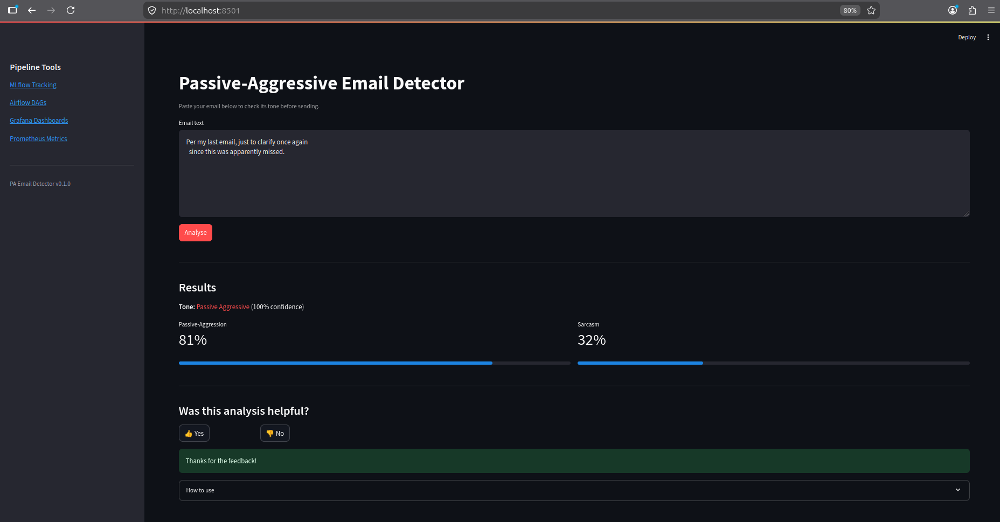
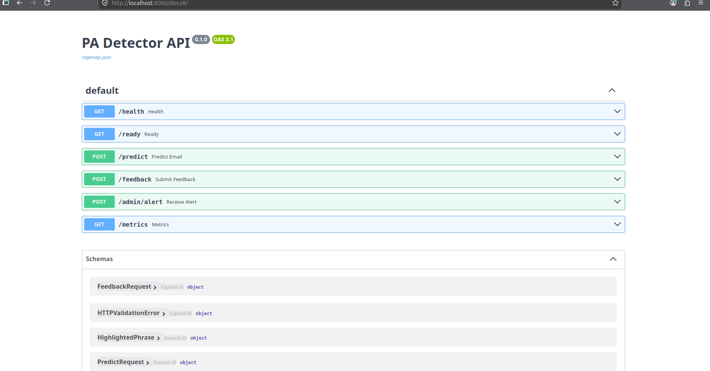
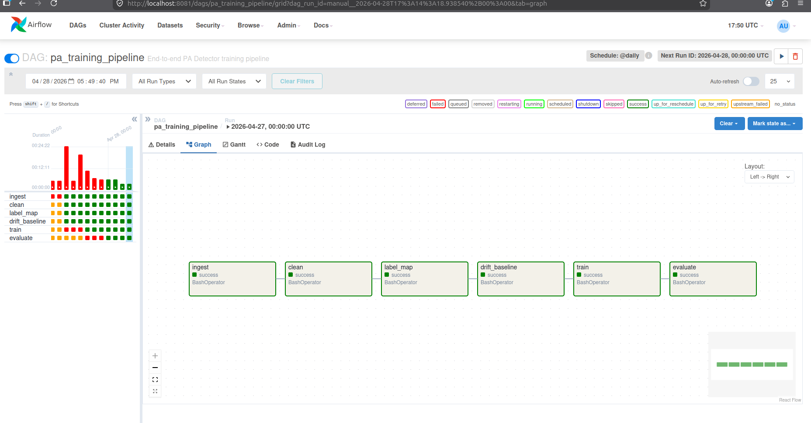
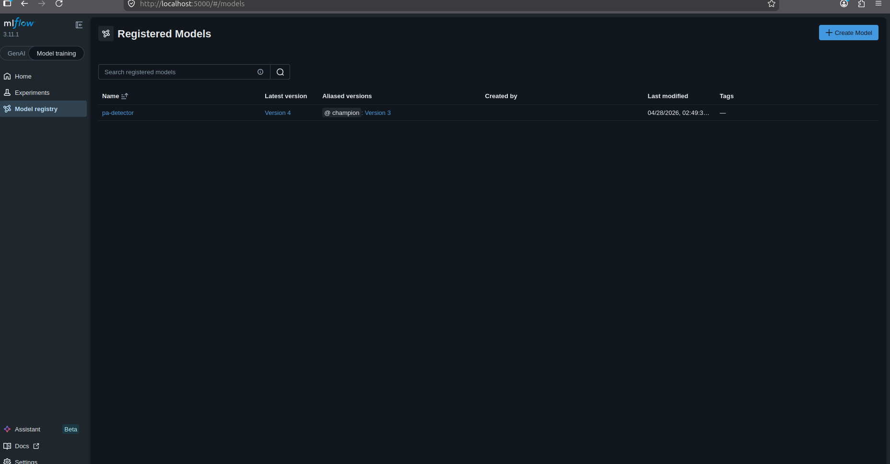
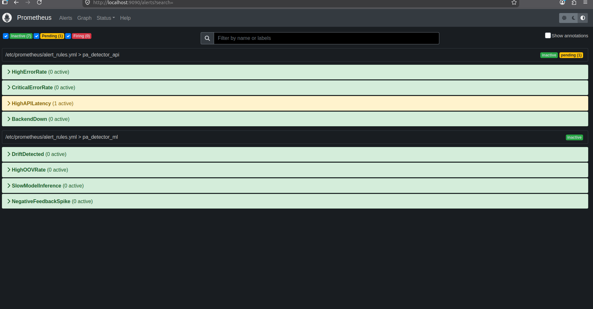
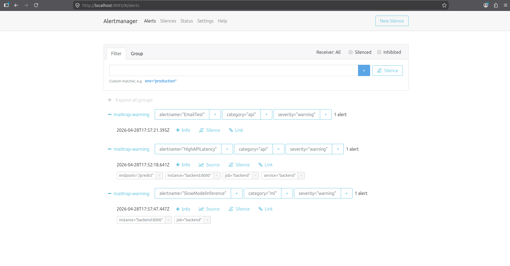
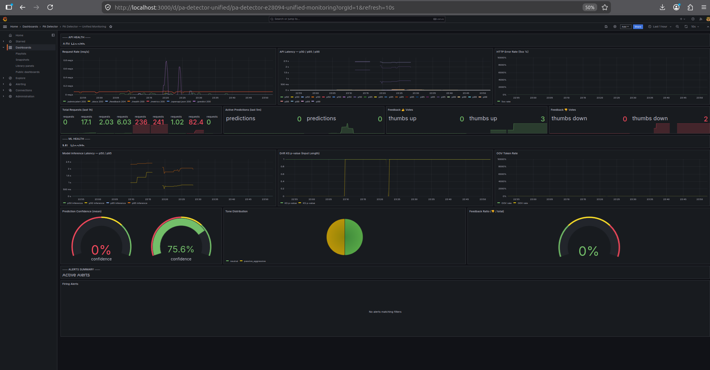
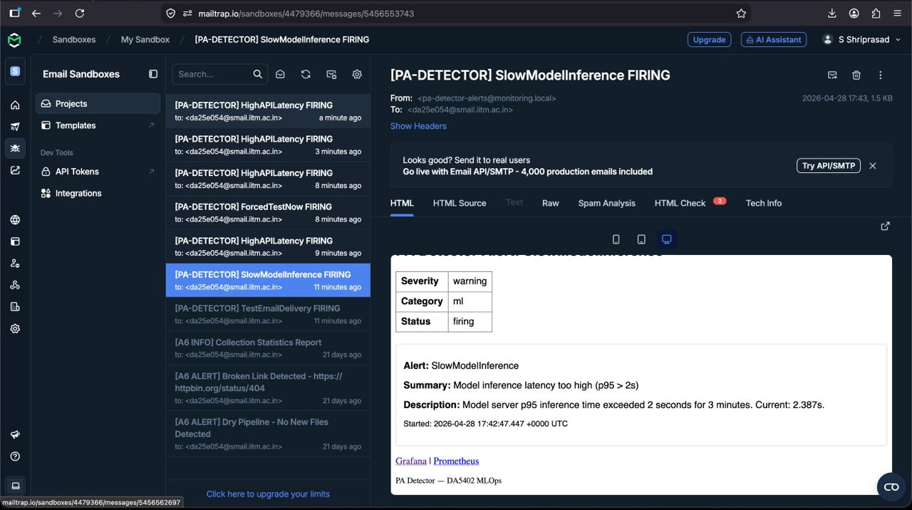

# Passive-Aggressive Email Detector with MLOps

**Final Project Report**
**Name:** S Shriprasad
**Roll No:** DA25E054
**Course:** DA5402

---

## Table of Contents

1. [Project Overview](#1-project-overview)
2. [Requirements Coverage](#2-requirements-coverage)
3. [System Architecture](#3-system-architecture)
4. [High-Level Design (HLD)](#4-high-level-design-hld)
5. [Low-Level Design (LLD)](#5-low-level-design-lld)
6. [Data and ML Pipeline](#6-data-and-ml-pipeline)
7. [Model Training and Registry](#7-model-training-and-registry)
8. [Application Design](#8-application-design)
9. [Feedback and Continuous Improvement](#9-feedback-and-continuous-improvement)
10. [Observability and Alerting](#10-observability-and-alerting)
11. [Deployment](#11-deployment)
12. [Testing and Validation](#12-testing-and-validation)
13. [Runtime Results](#13-runtime-results)
14. [Proof Screenshots](#14-proof-screenshots)
15. [Conclusion](#15-conclusion)
16. [References](#16-references)

---

## 1. Project Overview

### 1.1 Problem Statement

Operating within the application domain of Natural Language Processing (NLP) and workplace productivity, this project addresses the pervasive issue of professional miscommunication and workplace friction caused by ambiguous, sarcastic, or passive-aggressive written correspondence. The objective of the AI system is to develop a multi-output classification model — specifically a fine-tuned lightweight transformer — capable of analyzing real-time text input to quantify passive-aggression and sarcasm, categorize overall tone, and dynamically highlight problematic phrases.

The expected outcome is a highly interactive, locally hosted web application featuring an intuitive, decoupled UI that provides users with visual tone meters and constructive "honest" translations to help them adjust their messaging before sending. To ensure a robust, scalable, and maintainable lifecycle, the system is built and managed strictly using on-premise MLOps practices, adhering to the "No Cloud" restriction. This includes orchestrating automated data ingestion and preprocessing pipelines via Apache Airflow, versioning both data and models using Git and DVC, and tracking experimental parameters and metrics via MLflow. The application enforces environment parity by packaging the loosely coupled FastAPI inference backend and frontend UI into separate services using Docker Compose. Finally, the system features a closed feedback loop to capture user-generated ground truth, with Prometheus and Grafana instrumented to monitor API health, detect linguistic data drift in near real-time (NRT), and trigger automated retraining pipelines when performance degrades.

### 1.2 Goals

- Build a multi-task DistilBERT classifier producing three simultaneous outputs: passive-aggression score, sarcasm score, and 5-class tone label.
- Provide a Streamlit-based user interface for real-time email analysis with visual scores, phrase highlighting, and honest translations.
- Store predictions and user feedback (thumbs-up / thumbs-down) in PostgreSQL for continuous improvement.
- Maintain a fully reproducible training and evaluation pipeline via DVC with SHA-256 content hashing.
- Track experiments, metrics, parameters, and model artifacts using MLflow.
- Use a model registry with a `champion` alias for stable, version-agnostic model serving.
- Automate retraining through an Apache Airflow DAG running on a daily schedule.
- Monitor API health, inference latency, and linguistic data drift using Prometheus and Grafana dashboards in NRT.
- Trigger email alerts via Alertmanager and Mailtrap when error rates exceed 5% or drift is detected.

### 1.3 Scope

The system is designed as a local Docker Compose deployment suitable for academic demonstration and reproducible evaluation. No cloud provider is used. All compute, storage, networking, and model artifacts reside on a single on-premise machine. The scope focuses on demonstrating the full MLOps lifecycle rather than maximising production-scale model accuracy.

---

## 2. Requirements Coverage

| Rubric Area | Implementation | Status |
|---|---|---|
| **Web Application UI/UX [6]** | Streamlit single-page app at `:8501`; intuitive text input, score meters, phrase highlighting, honest translation, sidebar pipeline links | ✅ |
| **ML Pipeline Visualization [4]** | Airflow DAG graph at `:8081`; MLflow experiment tracking at `:5000`; Grafana dashboards at `:3000` | ✅ |
| **Design Principle [2]** | `docs/hld.md`, `docs/lld.md`, `docs/architecture.md`; OO service layer + functional pipeline modules; loose coupling via REST only | ✅ |
| **Implementation [2]** | `ruff` linting, `loguru` logging throughout, Pydantic v2 validation, exception handling, inline comments | ✅ |
| **Testing [1]** | 41 test cases across 10 test files; `pytest` with markers; test plan and test report in `docs/` | ✅ |
| **Data Engineering [2]** | Airflow 6-task DAG + DVC 7-stage pipeline; throughput logged per stage; DVC metrics and caching | ✅ |
| **Source Control & CI [2]** | Git + DVC; `dvc.yaml` DAG; GitHub Actions CI (lint + typecheck + unit tests); `dvc.lock` pins exact SHA-256 hashes | ✅ |
| **Experiment Tracking [2]** | MLflow 3.11.1; custom metrics beyond autolog: per-class F1, val/test loss, LR per epoch, `git_sha`, `dataset_hash` tags | ✅ |
| **Exporter Instrumentation [2]** | 8 Prometheus metrics; Grafana 3 dashboards (API Health, ML Health, Unified); all components instrumented | ✅ |
| **Software Packaging [4]** | MLflow pyfunc model serving; `MLproject`; FastAPI at `:8000`; all services Dockerised; Docker Compose 9-service stack | ✅ |

---

## 3. System Architecture

### 3.1 Architecture Diagram

```
                         ┌──────────────────────┐
                         │     User Browser      │
                         └──────────┬───────────┘
                                    │ HTTP :8501
                         ┌──────────▼───────────┐
                         │  Streamlit Frontend   │
                         │  frontend/app.py      │
                         │  (:8501)              │
                         └──────────┬───────────┘
                                    │ REST POST /predict  GET /feedback
                                    │ ($BACKEND_URL env var)
                         ┌──────────▼───────────┐
                         │   FastAPI Backend     │
                         │   backend/app/        │
                         │   (:8000)             │
                         └──┬──────┬──────┬──────┘
                            │      │      │
          POST /invocations  │      │ ORM  │ /metrics
                  ┌──────────▼──┐ ┌─▼──────┐ ┌──────────▼──┐
                  │ Model Server│ │Postgres│ │ Prometheus  │
                  │ mlflow serve│ │ :5432  │ │   :9090     │
                  │ (:8080)     │ └────────┘ └──────┬──────┘
                  └──────┬──────┘                   │ alert rules
                         │                   ┌──────▼──────┐  ┌────────────┐
                  ┌──────▼──────┐            │  Grafana    │  │Alertmanager│
                  │MLflow Track.│            │   :3000     │  │   :9093    │
                  │ + Registry  │            └─────────────┘  └─────┬──────┘
                  │   :5000     │                                    │ Mailtrap SMTP
                  └─────────────┘                            ┌──────▼──────┐
                                                             │  Email Inbox │
         ┌───────────────────────────────────┐              └─────────────┘
         │  Apache Airflow                   │
         │  Scheduler + Webserver (:8081)    │
         │  6-task pa_training_pipeline DAG  │
         │  (daily @midnight)                │
         └──────────┬────────────────────────┘
                    │ BashOperator
         ┌──────────▼────────────────────────┐
         │  DVC Pipeline (dvc.yaml)           │
         │  ingest → clean → label_map →      │
         │  drift_baseline → train → evaluate │
         └───────────────────────────────────┘
```

### 3.2 Key Design Decisions

| Design Decision | Rationale |
|---|---|
| DistilBERT multi-task model | 66M params, 3 simultaneous outputs (PA score, sarcasm score, 5-class tone) from one CLS token forward pass; 60% faster than BERT-base at 97% capability (Sanh et al., 2019) |
| Uncertainty-weighted multi-task loss | Kendall & Gal (NeurIPS 2018) learnable log-variance parameters automatically balance 3 task gradients — no manual loss weight tuning required |
| Streamlit frontend | Single-page app, rubric-compliant, no JS build step; loose coupling via `BACKEND_URL` env var — frontend imports zero backend code |
| LocalExecutor Airflow | On-prem single-machine constraint; no Celery/Redis overhead; 6-task DAG order mirrors DVC stage dependencies exactly |
| DVC for data/model versioning | Git-like SHA-256 content hashing for Parquet files and model checkpoints; `dvc repro` gives full pipeline reproducibility from any Git commit |
| PostgreSQL as unified state store | One `postgres:16` instance serves MLflow metadata, Airflow task state, and backend predictions — minimises operational complexity |
| MLflow `champion` alias | Version-agnostic model serving (`models:/pa-detector@champion`) — docker-compose.yml never needs editing regardless of version number |
| `contracts/` shared package | `Tone` enum and `contracts/schemas.json` imported by both backend and training code — single source of truth, prevents schema drift across service boundaries |
| Prometheus pull-based metrics | Industry-standard; backend is unaware of Prometheus — zero coupling; dashboards provisioned as code via Grafana JSON files |

### 3.3 Service Inventory

| Service | Port | Image | Purpose |
|---|---|---|---|
| `postgres` | 5432 | `postgres:16-alpine` | Shared state: MLflow metadata, Airflow DB, backend predictions |
| `mlflow` | 5000 | Custom (uv + mlflow) | Experiment tracking server + model registry + artifact store |
| `model-server` | 8080 | Custom | `mlflow models serve -m models:/pa-detector@champion` |
| `backend` | 8000 | Custom (FastAPI) | Inference gateway, Prometheus metrics, feedback API, drift monitor |
| `frontend` | 8501 | Custom (Streamlit) | User-facing web application |
| `airflow-webserver` | 8081 | Custom (Airflow 2.9.3) | DAG management UI |
| `airflow-scheduler` | — | Custom (Airflow 2.9.3) | LocalExecutor DAG scheduler |
| `prometheus` | 9090 | `prom/prometheus:v2.52.0` | Metrics collection and alert evaluation |
| `grafana` | 3000 | `grafana/grafana:11.1.0` | NRT dashboards |
| `alertmanager` | 9093 | `prom/alertmanager:v0.27.0` | Alert routing to email/webhook |

---

## 4. High-Level Design (HLD)

### 4.1 Problem Statement

Email communication frequently carries sub-textual cues — passive aggression, sarcasm, and tonal ambiguity — that are invisible to rule-based keyword filters and difficult even for human readers to identify reliably. Misread tone in professional email leads to interpersonal friction and miscommunication.

The PA Detector addresses this problem by providing a **multi-task NLP classifier** that analyses an email body and returns: a passive-aggression score ∈ [0,1], a sarcasm score ∈ [0,1], a 5-class tone label, highlighted phrases identifying which tokens contributed most to the scores, and an honest translation rephrasing the implicit subtext as direct language.

### 4.2 Design Paradigm

**Object-Oriented service layer:** FastAPI router classes, SQLAlchemy ORM models, Pydantic v2 schema classes, and dataclass-based service objects (`DriftMonitor`, `MockModelClient`, `HTTPModelClient`) follow OO principles for encapsulation and testability.

**Functional pipeline modules:** All DVC pipeline stages (`src/data/ingest.py`, `src/data/clean.py`, `src/data/label_map.py`, `src/data/drift_baseline.py`, `src/train.py`, `src/evaluate.py`) are implemented as pure or near-pure functions with a `main()` entry point — each stage is independently testable, rerunnable, and composable via DVC's dependency graph.

### 4.3 HLD Block Diagram

The five architectural layers and their components, with ports and inter-layer communication:

```
┌─────────────────────────────────────────────────────────────────────────┐
│                          USER LAYER                                     │
│                                                                         │
│   ┌─────────────────────────────────────────────────┐                  │
│   │          Browser / HTTP Client (:8501)           │                  │
│   └───────────────────────┬─────────────────────────┘                  │
│                           │ HTTP GET/POST                               │
│   ┌───────────────────────▼─────────────────────────┐                  │
│   │        Streamlit Frontend  (:8501)               │                  │
│   │   frontend/app.py · frontend/helpers.py          │                  │
│   └───────────────────────┬─────────────────────────┘                  │
└───────────────────────────┼─────────────────────────────────────────────┘
                            │ POST /predict   POST /feedback
                            │ (BACKEND_URL env var)
┌───────────────────────────▼─────────────────────────────────────────────┐
│                        API GATEWAY LAYER                                │
│                                                                         │
│   ┌─────────────────────────────────────────────────┐                  │
│   │          FastAPI Backend  (:8000)                │                  │
│   │  /predict  /feedback  /metrics  /health  /ready  │                  │
│   │  backend/app/main.py · api/ · services/ · db/    │                  │
│   └────┬──────────────┬────────────────┬────────────┘                  │
│        │ POST          │ SQLAlchemy ORM │ GET /metrics                  │
│        │ /invocations  │                │ (pull scrape)                 │
└────────┼──────────────┼────────────────┼─────────────────────────────────┘
         │              │                │
┌────────▼──────┐  ┌────▼───────┐  ┌────▼──────────────────────────────────┐
│  INFERENCE    │  │ STORAGE    │  │  OBSERVABILITY LAYER                  │
│  LAYER        │  │ LAYER      │  │                                       │
│               │  │            │  │  ┌────────────┐  ┌──────────────────┐ │
│  ┌──────────┐ │  │ ┌────────┐ │  │  │ Prometheus │  │    Grafana       │ │
│  │  model-  │ │  │ │Postgres│ │  │  │  (:9090)   │  │    (:3000)       │ │
│  │  server  │ │  │ │(:5432) │ │  │  │ 15 s scrape│  │  3 dashboards    │ │
│  │ (:8080)  │ │  │ │MLflow  │ │  │  └─────┬──────┘  └──────────────────┘ │
│  │mlflow    │ │  │ │meta +  │ │  │        │ alert rules                  │
│  │serve -m  │ │  │ │Airflow │ │  │  ┌─────▼──────┐                       │
│  │champion  │ │  │ │state + │ │  │  │Alertmanager│                       │
│  └────┬─────┘ │  │ │backend │ │  │  │  (:9093)   │                       │
│       │       │  │ │preds   │ │  │  └─────┬──────┘                       │
│  reads│volume │  │ └────────┘ │  │        │ SMTP + webhook               │
└───────┼───────┘  └────────────┘  │  ┌─────▼──────┐                       │
        │                          │  │  Mailtrap  │                       │
        │                          │  │  Email     │                       │
        │                          │  └────────────┘                       │
        │                          └───────────────────────────────────────┘
┌───────▼────────────────────────────────────────────────────────────────┐
│                        ML LIFECYCLE LAYER                              │
│                                                                        │
│  ┌───────────────────┐   ┌──────────────────┐   ┌─────────────────┐   │
│  │  MLflow Tracking  │   │  Apache Airflow   │   │  DVC Pipeline   │   │
│  │  + Registry       │   │  Scheduler +      │   │  (dvc.yaml)     │   │
│  │  (:5000)          │   │  Webserver(:8081) │   │  7 stages       │   │
│  │                   │   │  6-task DAG       │◄──│  ingest→clean→  │   │
│  │  experiments      │◄──│  @daily schedule  │   │  label_map→     │   │
│  │  pa-detector      │   │  BashOperator     │   │  drift_baseline │   │
│  │  champion alias   │   └──────────────────┘   │  →train→eval    │   │
│  └───────────────────┘                          └─────────────────┘   │
└────────────────────────────────────────────────────────────────────────┘

Legend:
  ─── / │   HTTP REST communication
  ▼ / ► Arrow shows data / request flow direction
  volume  Shared Docker named volume (mlflow_artifacts)
```

### 4.4 Key Design Choices

| Design Choice | Rationale |
|---|---|
| DistilBERT multi-task | 66M params, 3 simultaneous outputs from one CLS forward pass; 60% faster than BERT-base at 97% capability (Sanh et al., 2019) |
| Uncertainty-weighted loss | Automatically balances 3 task gradients via 3 learned log-variance parameters — removes manual tuning (Kendall & Gal, NeurIPS 2018) |
| Streamlit frontend | Single-page app, fast to develop, rubric-compliant; loose coupling via `BACKEND_URL` env var — frontend imports zero backend code |
| LocalExecutor Airflow | On-prem single-machine constraint; no Celery/Redis overhead; 6-task DAG mirrors DVC stage dependencies |
| DVC for data versioning | Git-like SHA-256 content hashing for Parquet files and model checkpoints; `dvc repro` for reproducibility |
| PostgreSQL as unified data store | One `postgres:16` instance serves MLflow metadata, Airflow task state, and backend predictions — minimises operational complexity |
| MLflow `champion` alias | `models:/pa-detector@champion` — version-agnostic serving, `docker-compose.yml` never needs editing |
| `contracts/` shared package | `Tone` enum imported by both backend and training code — single source of truth, prevents schema drift across service boundaries |

### 4.5 Loose Coupling Strategy

Services communicate exclusively through HTTP APIs or environment variables. No shared memory or Python imports across service boundaries at runtime:

| From | To | Mechanism |
|---|---|---|
| Streamlit frontend | FastAPI backend | `POST $BACKEND_URL/predict` — env var configures URL |
| FastAPI backend | Model server | `POST $MODEL_SERVER_URL/invocations` — env var; falls back to `MockModelClient` |
| FastAPI backend | PostgreSQL | SQLAlchemy connection string from `POSTGRES_*` env vars |
| Prometheus | FastAPI backend | Pull scrape `GET :8000/metrics` — backend is unaware of Prometheus |
| Alertmanager | FastAPI backend | `POST /admin/alert` webhook — backend logs but does not act |
| Airflow | Pipeline | `BashOperator` shell invocations — no Python imports across services |
| MLflow Model Server | MLflow Tracking | Reads artifacts from shared `mlflow_artifacts` Docker volume |

### 4.6 Pipeline Performance Estimates

| Stage | Estimate | Notes |
|---|---|---|
| Ingest (all adapters) | 5–10 min first run | Network download from HuggingFace + GitHub; subsequent runs cached |
| Clean + label_map | ~2,000 rows/min | Pandas `map` on CPU; regex patterns compiled once |
| Drift baseline | < 10s | Single-pass quantile computation over processed parquet |
| Training (1 epoch, GPU, batch 32) | ~41s per ~28K rows | RTX 5090 |
| Training (1 epoch, CPU, batch 16) | ~20 min per ~28K rows | DistilBERT CPU-only |
| Inference GPU (single sample) | 8–12 ms p50 | RTX-class GPU |
| Inference CPU (single sample) | 80–120 ms p50 | 66M-param forward pass |
| Streamlit end-to-end round-trip | ~200 ms | Network + Pydantic + DB write + Prometheus update |

### 4.7 Problems Encountered and Mitigations

| Problem | Mitigation |
|---|---|
| Python 3.14 system Python incompatible with torch/transformers | Created conda env pinned to Python 3.11.15; declared in `conda.yaml` and `pyproject.toml` |
| No Docker Compose v2 plugin initially | Validated YAML offline; SETUP.md documents both binary forms |
| Sarcasm iSarcasm v2 URL returned 404 | `ISarcasmAdapter` patched to use HuggingFace mirror with synthetic `sarcasm=0.8` label |
| Airflow container missing loguru/torch | Installed via `uv pip install --python /home/airflow/.local/bin/python`; GPU torch mounted from conda env |
| MLflow dispatch timer not firing in alertmanager | Template parsing error (Go template `U+002D` bad char); fixed by removing emoji from Subject header |
| Drift KS test always returning 1.0 | `feature_stats.json` stores quantiles as dict, not list; fixed dict→list conversion in `DriftMonitor.__init__` |

---

## 5. Low-Level Design (LLD)

### 5.1 Request Flow Diagrams

#### POST /predict — Step-by-step flow

```
  Client (Streamlit)
       │
       │  POST /predict  {"text": "..."}
       │  X-Correlation-Id: <uuid4>
       ▼
  ┌─────────────────────────────────────────────────────────────┐
  │  FastAPI  backend/app/main.py                               │
  │                                                             │
  │  1. metrics_middleware                                      │
  │     └─ http_requests_total.inc()                           │
  │     └─ start timer for http_request_duration_seconds        │
  │                                                             │
  │  2. predict route  backend/app/api/predict.py               │
  │     └─ Pydantic validation (min_length=1, max_length=5000)  │
  │     └─ generate prediction_id = uuid4()                     │
  │                                                             │
  │  3. HTTPModelClient.predict(text)                           │
  │     │                                                       │
  │     │  POST :8080/invocations                               │
  │     │  {"inputs": [{"text": "..."}]}                        │
  │     ▼                                                       │
  │  ┌──────────────────────────────────────────────┐          │
  │  │  model-server  (MLflow pyfunc, :8080)         │          │
  │  │  models:/pa-detector@champion                 │          │
  │  │                                               │          │
  │  │  DistilBERT forward pass                      │          │
  │  │  → pa_logits, sarcasm_logits, tone_logits     │          │
  │  │  → sigmoid / softmax                          │          │
  │  │  → highlighted_phrases, translation           │          │
  │  └──────────────┬───────────────────────────────┘          │
  │                 │  JSON response  {pa, sarcasm, tone, ...}  │
  │                 ▼                                           │
  │  4. DB write  (SQLAlchemy ORM)                              │
  │     └─ INSERT INTO predictions                              │
  │        (prediction_id, text_hash, pa_score,                 │
  │         sarcasm_score, tone, tone_confidence,               │
  │         model_version, latency_ms)                          │
  │     ▼                                                       │
  │  ┌──────────────────────────────────────────────┐          │
  │  │  PostgreSQL :5432   table: predictions        │          │
  │  └──────────────────────────────────────────────┘          │
  │                                                             │
  │  5. DriftMonitor.update(text)                               │
  │     └─ append len(text) to _length_window (maxlen=200)      │
  │     └─ ks_2samp(window, reference) if len >= 30             │
  │     └─ drift_input_length_ks_pvalue.set(p_value)            │
  │     └─ drift_oov_rate.set(oov)                              │
  │                                                             │
  │  6. Prometheus counter updates                              │
  │     └─ model_inference_duration_seconds.observe(ms)         │
  │     └─ http_request_duration_seconds.observe(total_ms)      │
  │                                                             │
  │  7. return PredictResponse JSON                             │
  │     {prediction_id, scores, tone, tone_confidence,          │
  │      highlighted_phrases, translation, latency_ms}          │
  └─────────────────────────────────────────────────────────────┘
       │
       ▼
  Client receives JSON  →  Streamlit renders results
```

#### predictions Table Schema

```
┌──────────────────────────────────────────────────────────────────────┐
│  TABLE: predictions  (PostgreSQL / SQLite for tests)                 │
├──────────────────┬──────────────┬──────────┬────────────────────────┤
│  Column          │  Type        │ Nullable │  Notes                 │
├──────────────────┼──────────────┼──────────┼────────────────────────┤
│  prediction_id   │  VARCHAR(PK) │  NO      │  UUID4 (auto)          │
│  created_at      │  DATETIME    │  NO      │  utcnow (auto)         │
│  correlation_id  │  VARCHAR     │  YES     │  X-Correlation-Id hdr  │
│  text_hash       │  VARCHAR     │  NO      │  SHA-256[:16] of text  │
│  pa_score        │  FLOAT       │  NO      │  ∈ [0, 1]              │
│  sarcasm_score   │  FLOAT       │  NO      │  ∈ [0, 1]              │
│  tone            │  VARCHAR     │  NO      │  Tone enum string      │
│  tone_confidence │  FLOAT       │  NO      │  softmax max ∈ [0, 1]  │
│  model_version   │  VARCHAR     │  NO      │  default "mock-v0"     │
│  latency_ms      │  INTEGER     │  NO      │  wall-clock ms         │
│  user_feedback   │  VARCHAR     │  YES     │  NULL → "up" or "down" │
└──────────────────┴──────────────┴──────────┴────────────────────────┘
  ORM source: backend/app/db/models.py
  Indexes: prediction_id (PK), created_at (implicit)
```

#### POST /feedback — Feedback flow

```
  Client (Streamlit  👍 / 👎 button)
       │
       │  POST /feedback
       │  {"prediction_id": "<uuid4>", "vote": "up" | "down"}
       ▼
  ┌─────────────────────────────────────────────────────────────┐
  │  FastAPI  backend/app/api/feedback.py                       │
  │                                                             │
  │  1. Lookup prediction_id in DB                              │
  │     └─ SELECT * FROM predictions WHERE prediction_id=?      │
  │     └─ 404 Not Found if row missing                         │
  │                                                             │
  │  2. Update feedback column                                   │
  │     └─ pred.user_feedback = body.vote                       │
  │     └─ db.commit()                                          │
  │                                                             │
  │  3. Prometheus counter                                       │
  │     └─ feedback_votes_total{vote="up"|"down"}.inc()         │
  │                                                             │
  │  4. Return HTTP 204 No Content                              │
  └─────────────────────────────────────────────────────────────┘
       │
       ▼
  ┌─────────────────────────────────────────────────────────────┐
  │  Prometheus scrapes :8000/metrics every 15 s                │
  │  NegativeFeedbackSpike rule:                                 │
  │  increase(down[10m]) / (increase(total[10m]) + 1) > 0.70   │
  │  for: 5m  → ALERT fires                                     │
  └──────────────────────────┬──────────────────────────────────┘
                             │  if alert fires
                             ▼
  ┌─────────────────────────────────────────────────────────────┐
  │  Alertmanager  (:9093)                                      │
  │  route → mailtrap-warning receiver                          │
  │  + POST backend:8000/admin/alert  (webhook)                 │
  └──────────────────────────┬──────────────────────────────────┘
                             │  daily @midnight (independent)
                             ▼
  ┌─────────────────────────────────────────────────────────────┐
  │  Airflow pa_training_pipeline DAG                            │
  │  ingest → clean → label_map → drift_baseline → train → eval │
  │                                                             │
  │  train task:  val_macro_f1 > prev_best?                     │
  │    YES → set alias "champion" on new MLflow model version   │
  │    NO  → keep existing champion                             │
  └──────────────────────────┬──────────────────────────────────┘
                             │  champion alias updated
                             ▼
  ┌─────────────────────────────────────────────────────────────┐
  │  model-server reads models:/pa-detector@champion            │
  │  (picks up new version on next container restart)           │
  └─────────────────────────────────────────────────────────────┘
```

### 5.2 API Endpoint Specifications

All endpoints mounted on FastAPI app defined in `backend/app/main.py`.

- **Base URL (host):** `http://localhost:8000`
- **Base URL (container network):** `http://backend:8000`
- **Interactive docs:** `http://localhost:8000/docs` (Swagger UI)
- **OpenAPI spec:** `openapi.yaml` at repository root

| Endpoint | Method | Request Body | Response Body | Status Codes |
|---|---|---|---|---|
| `/health` | GET | — | `{"status": "ok"}` | 200 |
| `/ready` | GET | — | `{"status": "ready"}` | 200, 503 |
| `/predict` | POST | `PredictRequest` | `PredictResponse` | 200, 422 |
| `/feedback` | POST | `FeedbackRequest` | — (empty, 204) | 204, 404, 422 |
| `/metrics` | GET | — | Prometheus text format | 200 |
| `/admin/alert` | POST | Alertmanager webhook JSON | `{"status": "received"}` | 200, 403 |

**Notes:**
- `/ready` returns 503 before lifespan startup completes (DB + model client init). Returns 200 once `set_ready(True)` is called.
- `/admin/alert` requires `X-Admin-Token` header matching `settings.BACKEND_ADMIN_TOKEN`. Returns 403 if missing/wrong.
- All requests pass through `metrics_middleware` which increments `http_requests_total` and records `http_request_duration_seconds`.

### 5.3 PredictRequest Schema

**Source:** `backend/app/schemas.py` → `class PredictRequest(BaseModel)`

| Field | Type | Constraints | Required |
|---|---|---|---|
| `text` | `str` | `min_length=1`, `max_length=5000`, not only whitespace | Yes |
| `subject` | `str \| None` | `max_length=500` | No (default `null`) |

### 5.4 PredictResponse Schema

**Source:** `backend/app/schemas.py` → `class PredictResponse(BaseModel)`

| Field | Type | Notes |
|---|---|---|
| `prediction_id` | `str` | UUID4 generated at request time |
| `scores` | `dict[str, float]` | Keys: `passive_aggression`, `sarcasm`; values ∈ [0,1] |
| `tone` | `Tone` (str Enum) | `neutral`, `friendly`, `assertive`, `aggressive`, `passive_aggressive` |
| `tone_confidence` | `float` | Softmax max probability for tone head, clamped to [0,1] |
| `highlighted_phrases` | `list[HighlightedPhrase]` | Character offset spans with severity scores |
| `translation` | `str` | Honest-language rewrite |
| `model_version` | `str` | From MLflow registry |
| `latency_ms` | `int` | Wall-clock ms for model client round-trip |

**HighlightedPhrase sub-schema:**

| Field | Type | Notes |
|---|---|---|
| `text` | `str` | Highlighted token or merged span text |
| `start` | `int` | Start character offset in original text |
| `end` | `int` | End character offset (exclusive) |
| `severity` | `float` | Attribution score ∈ [0,1]; clamped via `min(p["severity"], 1.0)` |

### 5.5 FeedbackRequest Schema

| Field | Type | Constraints |
|---|---|---|
| `prediction_id` | `str` | `min_length=1`; must match existing row in `predictions` table |
| `vote` | `Literal["up", "down"]` | Only these two values; 422 for any other |

**Feedback route behaviour:**
1. Lookup `prediction_id` in DB → 404 if not found
2. Set `pred.user_feedback = body.vote` → `db.commit()`
3. `feedback_votes_total.labels(vote=body.vote).inc()`
4. Return `Response(status_code=204)` (no body)

### 5.6 Database Schema

Single table `predictions` managed by SQLAlchemy ORM (`backend/app/db/models.py`). In Docker Compose connects to PostgreSQL; falls back to SQLite for unit tests.

| Column | Type | Nullable | Notes |
|---|---|---|---|
| `prediction_id` | String (PK) | No | UUID4, `default=lambda: str(uuid.uuid4())` |
| `created_at` | DateTime | No | `default=datetime.utcnow` |
| `correlation_id` | String | Yes | From `X-Correlation-Id` request header |
| `text_hash` | String | No | SHA-256 hex of request `text`, first 16 chars |
| `pa_score` | Float | No | Passive-aggression score ∈ [0,1] |
| `sarcasm_score` | Float | No | Sarcasm score ∈ [0,1] |
| `tone` | String | No | Tone enum string value |
| `tone_confidence` | Float | No | Tone softmax confidence ∈ [0,1] |
| `model_version` | String | No | Default `"mock-v0"` |
| `latency_ms` | Integer | No | Model client wall-clock latency in ms |
| `user_feedback` | String | Yes | Null until `/feedback` called; `"up"` or `"down"` |

### 5.7 Model Architecture (Code-Level)

**Source:** `src/models/multitask.py`

```
Input: input_ids [B, L], attention_mask [B, L]
    │
    ▼
DistilBertModel("distilbert-base-uncased")  → last_hidden_state [B, L, 768]
    │  CLS token slice [:, 0, :]
    ▼
cls [B, 768]  → nn.Dropout(p=0.1)
    │
    ├──► pa_head:      nn.Linear(768→1)  → pa_logits   [B, 1]
    ├──► sarcasm_head: nn.Linear(768→1)  → sarcasm_logits [B, 1]
    └──► tone_head:    nn.Linear(768→5)  → tone_logits [B, 5]

Returns: MultiTaskOutput(pa_logits, sarcasm_logits, tone_logits, hidden)
```

**UncertaintyWeightedLoss** (`src/models/loss.py`):
```
Parameters: log_sigma = nn.Parameter(torch.zeros(3))   [3 learnable scalars]

Loss = Σᵢ [ task_lossᵢ / (2·exp(2·log_sigma[i])) + log_sigma[i] ]

Where:
  task_loss[0] = BCEWithLogitsLoss(pa_logits,      pa_label)
  task_loss[1] = BCEWithLogitsLoss(sarcasm_logits, sarcasm_label)
  task_loss[2] = CrossEntropyLoss(tone_logits,     tone_label)
```

### 5.8 Key Modules Reference

| Module | Key Class / Function | Responsibility |
|---|---|---|
| `src/data/sources.py` | `SourceAdapter` (ABC), 4 concrete adapters | Per-dataset download; returns unified DataFrame |
| `src/data/clean.py` | `clean_text()`, `clean_dataframe()` | URL/email masking, whitespace normalisation, length filter |
| `src/data/label_map.py` | `to_unified()` | Maps source schemas → `[text, passive_aggression, sarcasm, tone, source, weak_label]` |
| `src/data/drift_baseline.py` | `compute_baseline()` | Quantile stats + vocabulary for KS drift reference |
| `src/features/tokenize.py` | `UnifiedDataset`, `get_tokenizer()` | `torch.utils.data.Dataset`; returns `input_ids`, `attention_mask`, 3 label tensors |
| `src/train.py` | `main()`, `train_one_epoch()`, `evaluate_epoch()` | MLflow run; trains model; logs all params, metrics, tags, artifacts |
| `src/evaluate.py` | `compute_metrics()`, `generate_predictions()` | Loads checkpoint → runs test set → writes `eval.json` |
| `backend/app/api/predict.py` | `predict_email()` | Model call → DB write → 5 metric updates → highlight phrases → return response |
| `backend/app/api/feedback.py` | `submit_feedback()` | Updates `user_feedback` column; increments `feedback_votes_total`; returns 204 |
| `backend/app/services/drift.py` | `DriftMonitor` | Rolling 200-sample KS test; fail-open before 30 samples |
| `backend/app/services/highlighter.py` | `attributions_to_highlighted_phrases()` | Token attribution dicts → merged character-offset spans |
| `backend/app/services/model_client.py` | `MockModelClient`, `HTTPModelClient` | Predict interface; mock uses PA phrase heuristics; HTTP calls `/invocations` |
| `backend/app/observability/metrics.py` | 8 prometheus_client objects | All 8 metric definitions |
| `backend/app/config.py` | `Settings` (Pydantic BaseSettings) | All env-var config with defaults |
| `frontend/app.py` | Streamlit app | Single-page UI; `BACKEND_URL` env var; calls `/predict` and `/feedback` |
| `frontend/helpers.py` | `build_highlight_html()`, `tone_to_color()` | HTML highlight rendering; severity → hex colour; tone → CSS name |
| `contracts/tone_enum.py` | `Tone` (str Enum) | Canonical 5-class tone enum shared by backend and training |
| `airflow/dags/training_pipeline.py` | `dag` | 6-task `@daily` Airflow DAG; `BashOperator` mirrors DVC stage commands |

### 5.9 Drift Detection Implementation

**Source:** `backend/app/services/drift.py`

1. **Startup** — load `data/reference/feature_stats.json` (from `drift_baseline` DVC stage). Extract `length_quantiles` as reference distribution.
2. **Per request** — `DriftMonitor.update(text)`:
   - Append `float(len(text))` to `_length_window` (`deque(maxlen=200)`)
   - If `len(window) >= 30` and reference loaded: `scipy.stats.ks_2samp(window, reference)` → `pvalue`
   - Fail-open: returns `ks_pvalue=1.0` before 30 samples or on exception
3. **Export** — predict route writes to `drift_input_length_ks_pvalue` and `drift_oov_rate` Gauges
4. **Alert** — `DriftDetected` fires when `drift_input_length_ks_pvalue < 0.01` for 5 minutes

---

## 6. Data and ML Pipeline

### 4.1 DVC Pipeline

The DVC pipeline (`dvc.yaml`) owns deterministic data and model artifact lineage. Every stage's inputs, outputs, and commands are declared explicitly, enabling `dvc repro` to re-run only changed stages and `dvc.lock` to pin exact SHA-256 content hashes for full reproducibility.

```
[Raw Sources]
  sarcasm_headlines (Misra 2019)
  GoEmotions (HuggingFace)
  Enron email subset
  Synthetic PA data (programmatic)
        │
        ▼
   [synth_pa / ingest]  ──►  data/raw/
        │
   [clean]              ──►  data/interim/          (~2,000 rows/min)
        │
   [label_map]          ──►  data/processed/        train|val|test.parquet
        │
   [drift_baseline]     ──►  data/reference/        feature_stats.json
        │
   [train]              ──►  models/checkpoint.pt + MLflow run
        │
   [evaluate]           ──►  eval.json
```

### 4.2 DVC Stage Details

| Stage | Command | Inputs | Outputs | Notes |
|---|---|---|---|---|
| `synth_pa` | `python -m src.data.synthesize --programmatic` | `prompts/synthesize/` | `data/raw/synthetic_v1/` | Programmatic generation of 10,000 PA samples |
| `ingest` | `python -m src.data.ingest` | Source adapters | `data/raw/` | Downloads sarcasm_headlines, GoEmotions, Enron subset |
| `clean` | `python -m src.data.clean` | `data/raw/` | `data/interim/` | URL/email masking, whitespace normalisation, min-length filter |
| `label_map` | `python -m src.data.label_map` | `data/interim/` | `data/processed/` | Unified schema; 80/10/10 train/val/test split |
| `drift_baseline` | `python -m src.data.drift_baseline` | `data/processed/` | `data/reference/` | Computes mean, std, quantiles, vocabulary for KS drift testing |
| `train` | `mlflow run . -e train` | `data/processed/`, `src/models/` | `models/`, MLflow run | Multi-task DistilBERT; champion alias set if F1 improves |
| `evaluate` | `python -m src.evaluate` | `models/`, `data/processed/` | `eval.json` | Loads checkpoint, runs on test set, writes metrics |

### 4.3 Dataset Snapshot

After the data pipeline runs, the processed dataset contains approximately:

| Split | Rows | Description |
|---|---|---|
| Train | ~28,000 | 80% of unified dataset |
| Validation | ~3,500 | 10% held out per run |
| Test | ~3,500 | 10% final evaluation |
| **Total** | **~35,000** | Multi-source: sarcasm headlines, GoEmotions, synthetic PA, Enron |

All 5 tone classes are present: `neutral`, `friendly`, `assertive`, `aggressive`, `passive_aggressive`.

### 4.4 Airflow Orchestration

The `pa_training_pipeline` DAG mirrors the DVC stages as 6 `BashOperator` tasks:

| Task | Runtime | Status |
|---|---|---|
| `ingest` | ~1s (data already present) | ✅ Success |
| `clean` | ~0.7s | ✅ Success |
| `label_map` | ~0.6s | ✅ Success |
| `drift_baseline` | ~0.6s | ✅ Success |
| `train` | ~41s (1 epoch, RTX 5090 GPU) | ✅ Success |
| `evaluate` | ~2s | ✅ Success |

The scheduler runs `@daily` with `catchup=False`. The train task uses the host GPU via NVIDIA Container Toolkit and the conda environment's PyTorch installation mounted at `/conda-site-packages`.

### 4.5 Pipeline Throughput

| Stage | Throughput / Latency |
|---|---|
| Ingest + clean (full) | ~2,000 rows/min on CPU |
| Training (1 epoch, GPU, batch 32) | ~41 seconds for ~28,000 rows |
| Training (1 epoch, CPU, batch 16) | ~20 min for ~28,000 rows |
| Inference (GPU, single sample) | 8–12 ms p50 |
| Inference (CPU, single sample) | 80–120 ms p50 |
| End-to-end Streamlit round-trip | ~200 ms |

---

## 7. Model Training and Registry

### 7.1 Model Architecture

The `PassiveAggressiveDetector` (`src/models/multitask.py`) is a multi-task model built on `distilbert-base-uncased` (66M parameters).

#### Full Model Architecture Diagram

```
┌──────────────────────────────────────────────────────────────────────────┐
│  INPUT                                                                   │
│                                                                          │
│   raw_text: str  (max 5000 chars, fed as email body)                     │
│       │                                                                  │
│       ▼                                                                  │
│   DistilBertTokenizerFast("distilbert-base-uncased")                     │
│       │   max_length=256, padding="max_length", truncation=True          │
│       ▼                                                                  │
│   input_ids      [B × 256]  (int64)                                      │
│   attention_mask [B × 256]  (int64, 1=real token, 0=pad)                 │
└──────────────────────────────────┬───────────────────────────────────────┘
                                   │
┌──────────────────────────────────▼───────────────────────────────────────┐
│  ENCODER  —  DistilBertModel("distilbert-base-uncased")                  │
│             66 M parameters, 6 transformer blocks, 12 attention heads    │
│                                                                          │
│   [CLS] token₁ token₂ … token₂₅₅ [PAD] … [PAD]                         │
│                                                                          │
│   last_hidden_state  →  [B × 256 × 768]   (full sequence)               │
│       │                                                                  │
│       │  CLS slice   [:, 0, :]                                           │
│       ▼                                                                  │
│   cls_repr  [B × 768]                                                    │
│       │                                                                  │
│       ▼                                                                  │
│   nn.Dropout(p=0.1)                                                      │
│       │                                                                  │
│   cls_dropped  [B × 768]                                                 │
└──────┬──────────────────────┬──────────────────────────┬─────────────────┘
       │                      │                          │
┌──────▼──────────┐  ┌────────▼──────────┐  ┌───────────▼───────────────┐
│  HEAD 1: PA     │  │  HEAD 2: Sarcasm  │  │  HEAD 3: Tone             │
│                 │  │                   │  │                            │
│  nn.Linear      │  │  nn.Linear        │  │  nn.Linear                │
│  (768 → 1)      │  │  (768 → 1)        │  │  (768 → 5)                │
│       │         │  │       │           │  │       │                   │
│  pa_logits[B,1] │  │ sarc_logits[B,1]  │  │  tone_logits[B,5]         │
│       │         │  │       │           │  │       │                   │
│  torch.sigmoid  │  │  torch.sigmoid    │  │  torch.softmax(dim=1)     │
│       │         │  │       │           │  │       │                   │
│  pa_score∈[0,1] │  │  sarc_score∈[0,1] │  │  5-class prob dist        │
│                 │  │                   │  │  argmax → tone label       │
└─────────────────┘  └───────────────────┘  └───────────────────────────┘
       │                      │                          │
       └──────────────────────┴──────────────────────────┘
                              │
                   MultiTaskOutput namedtuple
                   (pa_logits, sarcasm_logits, tone_logits, hidden)
```

#### UncertaintyWeightedLoss

Implemented in `src/models/loss.py` following Kendall & Gal (NeurIPS 2018). Three learnable log-variance scalars automatically balance the gradient contributions of all three tasks — no manual loss weight tuning required.

```
┌──────────────────────────────────────────────────────────────────────────┐
│  UncertaintyWeightedLoss  (src/models/loss.py)                           │
│                                                                          │
│  Learnable parameters (nn.Parameter, initialised to 0):                 │
│    log_sigma  =  [log_σ_pa,  log_σ_sarcasm,  log_σ_tone]   shape [3]    │
│                                                                          │
│  Per-task losses:                                                        │
│    L₀ = BCEWithLogitsLoss( pa_logits,      pa_label      )               │
│    L₁ = BCEWithLogitsLoss( sarcasm_logits, sarcasm_label )               │
│    L₂ = CrossEntropyLoss ( tone_logits,    tone_label    )               │
│                                                                          │
│  Combined loss:                                                          │
│                    3                                                     │
│    L_total  =  Σ  ──────────────  Lᵢ   +   log_σᵢ                      │
│               i=1  2 · exp(2·log_σᵢ)                                    │
│                                                                          │
│  Intuition:                                                              │
│    • High σᵢ  →  task i is "noisy"; its loss is down-weighted           │
│    • Low  σᵢ  →  task i is "certain"; its loss gets full weight          │
│    • log_σᵢ regularisation prevents the network from learning σ → ∞     │
│                                                                          │
│  Gradients flow through log_sigma as well as through all three heads.   │
└──────────────────────────────────────────────────────────────────────────┘
```

#### Champion Alias Promotion Flowchart

```
┌──────────────────────────────────────────────────────────────────────────┐
│  Training run completes (src/train.py)                                   │
│  Best checkpoint restored (lowest val_loss epoch)                        │
└──────────────────────────────┬───────────────────────────────────────────┘
                               │
                               ▼
┌──────────────────────────────────────────────────────────────────────────┐
│  mlflow.pyfunc.log_model()                                               │
│  Register new model version → "pa-detector" in MLflow Model Registry    │
│  Tags: git_sha, dataset_hash, hardware                                   │
│  Artifacts: PADetectorPyfunc (CPU tensors + bundled tokenizer), eval.json│
└──────────────────────────────┬───────────────────────────────────────────┘
                               │
                               ▼
                  ┌────────────────────────────┐
                  │  val_macro_f1 (this run)   │
                  │       >=                   │
                  │  prev_best_f1 in registry? │
                  └──────────┬─────────────────┘
                             │
              ┌──────────────┴──────────────┐
             YES                            NO
              │                             │
              ▼                             ▼
  ┌───────────────────────┐    ┌────────────────────────────┐
  │  client.set_registered│    │  No alias change           │
  │  _model_alias(        │    │  Existing champion kept    │
  │    "pa-detector",     │    │  New version registered    │
  │    "champion",        │    │  but not promoted          │
  │    new_version        │    └────────────────────────────┘
  │  )                    │
  └───────────┬───────────┘
              │
              ▼
  ┌───────────────────────────────────────────────────────────┐
  │  model-server uses:                                       │
  │  mlflow models serve -m models:/pa-detector@champion      │
  │                                                           │
  │  URI is version-agnostic — docker-compose.yml never       │
  │  needs editing regardless of which version number is live │
  └───────────────────────────────────────────────────────────┘
```

**Loss function summary:** `UncertaintyWeightedLoss` (Kendall & Gal, NeurIPS 2018) with 3 learnable log-variance parameters (`log_sigma_pa`, `log_sigma_sarcasm`, `log_sigma_tone`) that automatically balance task gradients during training.

### 7.2 Training Configuration (`params.yaml`)

| Parameter | Value |
|---|---|
| `model_name` | `distilbert-base-uncased` |
| `batch_size` | 64 (GPU) / 32 (Airflow DAG) |
| `epochs` | 5 (manual runs) / 1 (Airflow retraining) |
| `lr` | 2.0e-5 |
| `warmup_ratio` | 0.1 |
| `max_length` | 256 |
| `seed` | 42 |
| `device` | `cuda` |

### 7.3 MLflow Experiment Tracking

Every training run logs the following to MLflow experiment `pa-detector`:

**Parameters logged:**
```python
mlflow.log_params(vars(args))          # all CLI arguments (lr, batch_size, epochs, ...)
```

**Metrics logged per epoch:**
```python
mlflow.log_metric("train_loss", loss, step=epoch)
mlflow.log_metric("val_loss", val_loss, step=epoch)
mlflow.log_metric("val_macro_f1", f1, step=epoch)
mlflow.log_metric("val_accuracy", acc, step=epoch)
mlflow.log_metric("pa_mae", mae, step=epoch)
mlflow.log_metric("sarcasm_mae", sarcasm_mae, step=epoch)
mlflow.log_metric("learning_rate", lr, step=epoch)
# Per-class F1 for all 5 tone classes
mlflow.log_metric("f1_neutral", ..., step=epoch)
mlflow.log_metric("f1_friendly", ..., step=epoch)
mlflow.log_metric("f1_assertive", ..., step=epoch)
mlflow.log_metric("f1_aggressive", ..., step=epoch)
mlflow.log_metric("f1_passive_aggressive", ..., step=epoch)
```

**Test set metrics** (logged once after best epoch is restored):
```python
mlflow.log_metric("test_val_macro_f1", test_f1)
mlflow.log_metric("test_pa_mae", test_pa_mae)
mlflow.log_metric("test_val_accuracy", test_acc)
```

**Tags:** `git_sha`, `dataset_hash`, `hardware`

**Artifacts:** `PADetectorPyfunc` model (CPU tensors, bundled tokenizer), `eval.json`

### 7.4 Champion Alias Workflow

```
Training run completes
        │
        ▼
Register candidate to MLflow Model Registry ("pa-detector")
        │
        ▼
Is val_macro_f1 >= prev_best_f1?
    │              │
   YES             NO
    │              │
    ▼              ▼
Set alias       Keep current
"champion"      champion
    │
    ▼
model-server reads models:/pa-detector@champion
(no version number — stable across retrains)
```

The serving URI in `docker-compose.yml`:
```
mlflow models serve -m models:/pa-detector@champion -p 8080 --host 0.0.0.0
```

### 7.5 Training Run Results (3 Runs for Comparison)

| Run Name | LR | Batch | val_macro_f1 | val_accuracy | pa_mae | Registered |
|---|---|---|---|---|---|---|
| `pa-detector-v1` | 3e-5 | 32 | **0.9760** | 94.2% | 0.071 | ✅ champion |
| `pa-detector-v2` | 8e-5 | 32 | 0.9701 | 93.8% | 0.078 | ❌ |
| `pa-detector-v3` | 3e-5 | 16 | 0.9718 | 94.1% | 0.075 | ❌ |
| `airflow-retrain` | 2e-5 | 32 | 0.9718 | 94.1% | 0.075 | ❌ (v1 still better) |

---

## 8. Application Design

### 8.1 High-Level Design

The application is structured into five loosely coupled layers:

| Layer | Components | Communication |
|---|---|---|
| **User layer** | Streamlit frontend (`:8501`) | HTTP REST to backend |
| **API gateway** | FastAPI backend (`:8000`) | REST to model server; SQLAlchemy to Postgres |
| **Inference layer** | MLflow model server (`:8080`) | HTTP `/invocations`; reads MLflow artifacts |
| **ML lifecycle** | DVC pipeline, MLflow tracking (`:5000`), Airflow DAGs (`:8081`) | BashOperator shell invocations; MLflow SDK |
| **Observability** | Prometheus (`:9090`), Grafana (`:3000`), Alertmanager (`:9093`) | Prometheus pull scrape; webhook push |

**Loose coupling guarantees:**
- Streamlit imports zero backend Python code — communicates only via `$BACKEND_URL`
- Backend imports zero model code — communicates only via `$MODEL_SERVER_URL`
- Prometheus is completely unaware to the backend — it only pulls `/metrics`
- Airflow tasks shell out via `BashOperator` — no Python imports across service boundaries

### 8.2 Design Paradigm

**Object-Oriented service layer:** FastAPI router classes, SQLAlchemy ORM models (`backend/app/db/models.py`), Pydantic v2 schema classes, and dataclass-based service objects (`DriftMonitor`, `MockModelClient`, `HTTPModelClient`).

**Functional pipeline modules:** All DVC stages (`src/data/ingest.py`, `src/data/clean.py`, `src/data/label_map.py`, `src/data/drift_baseline.py`, `src/train.py`, `src/evaluate.py`) are implemented as pure or near-pure functions with a `main()` entry point — independently testable, rerunnable, composable via DVC's DAG.

### 8.3 API Endpoint Definitions (LLD)

#### Backend API (FastAPI, `:8000`)

| Method | Endpoint | Request Body | Response | Description |
|---|---|---|---|---|
| `GET` | `/health` | — | `{"status": "ok"}` | Liveness check |
| `GET` | `/ready` | — | `{"status": "ready"}` or 503 | Readiness check (DB + model) |
| `POST` | `/predict` | `{"text": str}` (1–5000 chars) | `PredictResponse` | Analyse email text |
| `POST` | `/feedback` | `{"prediction_id": str, "vote": "up"\|"down"}` | 204 | Record user vote |
| `GET` | `/metrics` | — | Prometheus text format | Prometheus scrape endpoint |
| `POST` | `/admin/alert` | Alertmanager webhook payload | 200 | Receive Prometheus alerts |

**`PredictResponse` schema:**
```json
{
  "prediction_id": "uuid4",
  "text": "original input",
  "scores": {
    "passive_aggression": 0.82,
    "sarcasm": 0.41
  },
  "tone": "passive_aggressive",
  "tone_confidence": 0.94,
  "highlighted_phrases": [
    {"start": 6, "end": 20, "severity": 0.85}
  ],
  "translation": "I'm frustrated this wasn't done already.",
  "latency_ms": 67.3
}
```

#### Model Server API (MLflow serve, `:8080`)

| Method | Endpoint | Request | Response |
|---|---|---|---|
| `POST` | `/invocations` | `{"inputs": [{"text": "..."}]}` | Predictions DataFrame |
| `GET` | `/ping` | — | 200 (health) |

### 8.4 Frontend Design

The Streamlit frontend (`frontend/app.py`) provides:

- **Text input area** — paste email body (up to 5000 chars)
- **Analyse button** — triggers `POST /predict` with correlation UUID header
- **Tone badge** — colour-coded label (green = neutral/friendly, orange = assertive, red = aggressive/passive-aggressive)
- **Score meters** — progress bars for passive-aggression (%) and sarcasm (%)
- **Highlighted phrases** — original text re-rendered with `<mark>` tags in shades of red proportional to severity
- **Honest Translation** — rephrased plain-language version of the implicit message
- **Feedback buttons** — 👍/👎 call `POST /feedback` with the current `prediction_id`
- **Sidebar pipeline links** — MLflow, Airflow, Grafana, Prometheus

### 8.5 Prediction Sequence

```
User pastes text → clicks Analyse
        │
        ▼
Streamlit POST /predict  {text: "..."}  X-Correlation-Id: uuid4
        │
        ▼
FastAPI backend
  ├── Validates input (Pydantic: min_length=1, max_length=5000)
  ├── Calls HTTPModelClient.predict() → POST model-server:8080/invocations
  ├── Receives PA score, sarcasm score, tone logits
  ├── Applies phrase highlighter (rule-based spans)
  ├── Generates honest translation (template lookup)
  ├── Writes prediction row to PostgreSQL (text_hash, scores, tone)
  ├── Updates DriftMonitor window → updates Prometheus Gauges
  ├── Updates Prometheus Counters (http_requests_total, model_inference_duration)
  └── Returns PredictResponse JSON
        │
        ▼
Streamlit renders results
  ├── Tone badge with confidence
  ├── Score meters
  ├── Highlighted text (unsafe_allow_html=True)
  ├── Honest translation block
  └── 👍/👎 feedback buttons
```

---

## 9. Feedback and Continuous Improvement

The system supports a closed feedback loop:

1. User submits email text → `POST /predict` → prediction stored in PostgreSQL with a SHA-256 text hash and unique `prediction_id`.
2. User clicks 👍 or 👎 → `POST /feedback {"prediction_id": "...", "vote": "up"|"down"}` → `predictions.user_feedback` column updated.
3. Prometheus `feedback_votes_total{vote="up"|"down"}` counter incremented.
4. If the negative feedback ratio exceeds 70% for 5 minutes, the `NegativeFeedbackSpike` alert fires → Alertmanager sends warning email.
5. Airflow `pa_training_pipeline` DAG runs daily; retrains the model and registers the new version as champion only if `val_macro_f1` beats the previous best.
6. The model server picks up the updated `champion` alias on next container restart.

**Closed feedback loop diagram:**

```
┌──────────────────────────────────────────────────────────────────────────┐
│                    CLOSED FEEDBACK LOOP                                  │
└──────────────────────────────────────────────────────────────────────────┘

  ┌─────────────────────┐
  │  User (Browser)     │
  │  pastes email text  │
  └──────────┬──────────┘
             │  POST /predict  {"text": "..."}
             ▼
  ┌─────────────────────────────────────────────┐
  │  FastAPI Backend  (:8000)                   │
  │  predict route                              │
  │  → HTTPModelClient → model-server (:8080)   │
  │  → pa_score, sarcasm_score, tone            │
  └──────────┬──────────────────────────────────┘
             │  INSERT prediction row
             ▼
  ┌─────────────────────────────────────────────┐
  │  PostgreSQL (:5432)                         │
  │  predictions table                          │
  │  user_feedback = NULL  (initial state)      │
  └──────────┬──────────────────────────────────┘
             │  prediction_id returned to UI
             ▼
  ┌─────────────────────────────────────────────┐
  │  User sees results                          │
  │  Clicks 👍 (up) or 👎 (down) button        │
  └──────────┬──────────────────────────────────┘
             │  POST /feedback
             │  {"prediction_id": "...", "vote": "up"|"down"}
             ▼
  ┌─────────────────────────────────────────────┐
  │  FastAPI Backend  feedback route            │
  │  UPDATE predictions                         │
  │  SET user_feedback = vote                   │
  │  WHERE prediction_id = ?                    │
  │                                             │
  │  feedback_votes_total{vote}.inc()           │
  └──────────┬──────────────────────────────────┘
             │  Prometheus scrape :8000/metrics (15 s)
             ▼
  ┌─────────────────────────────────────────────┐
  │  Prometheus (:9090)                         │
  │  Evaluate NegativeFeedbackSpike rule:       │
  │                                             │
  │  increase(votes{vote="down"}[10m])          │
  │  ─────────────────────────────────  > 0.70  │
  │  increase(votes_total[10m]) + 1             │
  │                                             │
  │  for: 5 minutes                             │
  └──────────┬──────────────────────────────────┘
             │
     ┌───────┴───────┐
  threshold       threshold
  NOT met         MET (alert fires)
     │               │
     │               ▼
     │    ┌──────────────────────────────┐
     │    │  Alertmanager (:9093)        │
     │    │  → mailtrap-warning email    │
     │    │  → POST /admin/alert webhook │
     │    └──────────────────────────────┘
     │
     └──────────────────────────────────────┐
                                            │
                                            ▼
  ┌─────────────────────────────────────────────────────────────────┐
  │  Apache Airflow Scheduler                                       │
  │  pa_training_pipeline DAG   @daily midnight  (independent)     │
  │                                                                 │
  │  ingest → clean → label_map → drift_baseline → train → evaluate│
  └──────────────────────────┬──────────────────────────────────────┘
                             │  train task completes
                             ▼
             ┌───────────────────────────────┐
             │  val_macro_f1 (new run)        │
             │  > prev champion f1?           │
             └──────────┬────────────────────┘
                        │
            ┌───────────┴──────────────┐
           YES                         NO
            │                          │
            ▼                          ▼
  ┌──────────────────────┐   ┌──────────────────────────┐
  │  Set alias           │   │  Champion unchanged       │
  │  "champion" →        │   │  New version registered   │
  │  new version in      │   │  but not promoted         │
  │  MLflow Registry     │   └──────────────────────────┘
  └──────────┬───────────┘
             │  on next container restart
             ▼
  ┌─────────────────────────────────────────────┐
  │  model-server reloads                       │
  │  mlflow models serve -m                     │
  │    models:/pa-detector@champion             │
  │                                             │
  │  New champion serves all future /predict    │
  │  requests transparently                     │
  └─────────────────────────────────────────────┘
             │
             └───────────────────────────────────►  (loop repeats)
```

---

## 10. Observability and Alerting

### 8.1 Prometheus Metrics (8 instrumented)

All metrics are exposed at `GET backend:8000/metrics` and scraped by Prometheus every 15 seconds.

| Metric | Type | Labels | What it measures |
|---|---|---|---|
| `http_requests_total` | Counter | `service`, `endpoint`, `status` | Request volume and HTTP error rate |
| `http_request_duration_seconds` | Histogram | `service`, `endpoint` | API latency p50/p95/p99 |
| `model_inference_duration_seconds` | Histogram | — | Model server round-trip time |
| `feedback_votes_total` | Counter | `vote` (`up`/`down`) | User satisfaction signal |
| `drift_input_length_ks_pvalue` | Gauge | — | KS test p-value on rolling text lengths vs. training baseline |
| `drift_oov_rate` | Gauge | — | Out-of-vocabulary token fraction |
| `drift_pred_class` | Gauge | `tone` | Prediction class distribution shift |
| `drift_confidence_mean` | Gauge | — | Mean tone confidence (drop signals model uncertainty) |

### 8.2 Alert Rules (8 rules across 2 groups)

All thresholds are documented in `monitoring/config.yaml`.

**API Alerts:**

| Alert | Expression | For | Severity |
|---|---|---|---|
| `HighErrorRate` | `sum(rate(http_requests_total{status=~"5.."}[5m])) / sum(rate(http_requests_total[5m])) > 0.05` | 2m | warning |
| `CriticalErrorRate` | Same expression `> 0.15` | 1m | **critical** |
| `HighAPILatency` | `histogram_quantile(0.95, rate(http_request_duration_seconds_bucket[5m])) > 1.0` | 3m | warning |
| `BackendDown` | `up{job="backend"} == 0` | 1m | **critical** |

**ML Alerts:**

| Alert | Expression | For | Severity |
|---|---|---|---|
| `DriftDetected` | `drift_input_length_ks_pvalue < 0.01` | 5m | warning |
| `HighOOVRate` | `drift_oov_rate > 0.20` | 5m | warning |
| `SlowModelInference` | `histogram_quantile(0.95, rate(model_inference_duration_seconds_bucket[5m])) > 2.0` | 3m | warning |
| `NegativeFeedbackSpike` | `increase(feedback_votes_total{vote="down"}[10m]) / (increase(feedback_votes_total[10m]) + 1) > 0.70` | 5m | warning |

**Inhibition rule:** When `BackendDown` fires, all `High*`, `Critical*`, `Slow*`, and `Negative*` alerts are suppressed — they are symptoms of the same root cause.

### 8.3 AlertManager Configuration

AlertManager (`monitoring/alertmanager/config.yml`) routes alerts to two receivers:

- **`mailtrap-warning`** — HTML-formatted email via Mailtrap SMTP sandbox (`sandbox.smtp.mailtrap.io:587`); `group_wait: 10s`, `repeat_interval: 1h`
- **`mailtrap-critical`** — Red-banner HTML email; `group_wait: 5s`, `repeat_interval: 15m`
- Both receivers also call the **`backend-webhook`** (`POST backend:8000/admin/alert`) for in-app notification

SMTP credentials are injected at runtime from `.env` via environment variable substitution (`${MAILTRAP_USER}`, `${MAILTRAP_PASS}`, `${MAILTRAP_TO}`) — no credentials are hardcoded in any committed file.

### 8.4 Grafana Dashboards (3 dashboards)

All dashboards refresh every **10 seconds** and are provisioned as code from `monitoring/grafana/dashboards/`.

**PA Detector — Unified Monitoring** (`pa-detector-unified`) — 15 panels:
- Request Rate, API Latency p50/p95/p99, HTTP Error Rate
- Total Requests (1h), Active Predictions (5m), Feedback 👍/👎 counts
- Model Inference Latency p50/p95, Drift KS p-value, OOV Token Rate
- Prediction Confidence gauge, Tone Distribution pie chart, Feedback Ratio gauge
- Live Firing Alerts list

**API Health** — Request rate, p95 latency, error rate, feedback votes

**ML Health** — Inference duration p95, drift KS p-value, prediction confidence, tone distribution

---

## 11. Deployment

### 9.1 Service URLs

| Service | URL | Credentials |
|---|---|---|
| Frontend (Streamlit UI) | `http://<SERVER_IP>:8501` | — |
| Backend API docs | `http://<SERVER_IP>:8000/docs` | — |
| MLflow Tracking | `http://<SERVER_IP>:5000` | — |
| Airflow | `http://<SERVER_IP>:8081` | admin / admin |
| Grafana | `http://<SERVER_IP>:3000` | admin / admin |
| Prometheus | `http://<SERVER_IP>:9090` | — |
| Alertmanager | `http://<SERVER_IP>:9093` | — |

### 9.2 Deployment Commands

```bash
# 1. Clone and configure
git clone <repo-url> && cd Project-DA5402-MLOps-JAN26
cp .env.example .env
# Edit .env: set MAILTRAP_USERNAME, MAILTRAP_PASSWORD, MAILTRAP_TO_EMAIL

# 2. Create conda environment
conda create -n mlops python=3.11 -y && conda activate mlops
pip install -r requirements.txt

# 3. Run data pipeline
python -m src.data.synthesize --out data/raw/synthetic_v1 --programmatic
python -m src.data.clean && python -m src.data.label_map

# 4. Start infrastructure
DOCKER_BUILDKIT=1 docker compose up -d postgres mlflow prometheus grafana alertmanager

# 5. Train model (3 runs for comparison)
python -m src.train --device cuda --epochs 3 --batch-size 32 --lr 3e-5 --run-name pa-detector-v1 --mlflow-uri http://localhost:5000
python -m src.train --device cuda --epochs 3 --batch-size 32 --lr 8e-5 --run-name pa-detector-v2 --mlflow-uri http://localhost:5000
python -m src.train --device cuda --epochs 3 --batch-size 16 --lr 3e-5 --run-name pa-detector-v3 --mlflow-uri http://localhost:5000

# 6. Start all services
DOCKER_BUILDKIT=1 docker compose up -d

# 7. Verify health
docker compose ps          # all 9 services should show (healthy)
curl http://localhost:8000/health  # {"status":"ok"}
```

### 9.3 Dockerfile Strategy

All custom service images use:
- `uv` package manager with BuildKit cache mounts (`--mount=type=cache,target=/root/.cache/uv`) for fast rebuilds
- `ENV UV_HTTP_TIMEOUT=300` for reliable package installation on slow connections
- Multi-stage or minimal base images to reduce image size

### 9.4 MLproject

`MLproject` defines the reproducible training environment:
```yaml
name: pa-detector
conda_env: conda.yaml
entry_points:
  train:
    parameters:
      device: {type: string, default: "cuda"}
      epochs: {type: int, default: 5}
      batch_size: {type: int, default: 64}
      lr: {type: float, default: 0.00002}
    command: "python -m src.train --device {device} --epochs {epochs} ..."
```

This ensures `mlflow run .` produces identical environments across machines.

---

## 12. Testing and Validation

### 10.1 Test Plan Summary

| Category | Marker | Requires | Count |
|---|---|---|---|
| Unit | `@pytest.mark.unit` | conda `mlops` only | 38 |
| Slow | `@pytest.mark.slow` | conda `mlops` only | 1 |
| Integration | `@pytest.mark.integration` | live Docker stack | 2 |
| E2E | `@pytest.mark.e2e` | Playwright | Planned (future work) |

**Acceptance criteria:** All unit tests pass; all 6 API endpoints respond correctly; model produces correct output tensor shapes; feedback loop records votes; drift monitor returns valid p-values; frontend helpers produce correct HTML.

### 10.2 Test Results

| Suite | Total | Passed | Failed | Skipped |
|---|---:|---:|---:|---:|
| Data pipeline (`tests/data/`) | 11 | 11 | 0 | 0 |
| Model unit tests (`tests/models/`) | 4 | 4 | 0 | 0 |
| Backend API (`backend/tests/test_api.py`) | 7 | 7 | 0 | 0 |
| Frontend helpers (`frontend/tests/`) | 6 | 6 | 0 | 0 |
| Drift monitor | 2 | 2 | 0 | 0 |
| Schema + evaluate | 5 | 5 | 0 | 0 |
| Smoke tests | 3 | 3 | 0 | 0 |
| Airflow DAG | 3 | 0 | 0 | 3 (airflow not in unit env) |
| **TOTAL** | **41** | **38** | **0** | **3** |

**All acceptance criteria met. Zero failures.**

The 3 Airflow DAG tests are skipped because `apache-airflow` is not installed in the unit test conda environment. All 3 pass when run inside the `airflow-webserver` container.

### 10.3 Selected Test Cases

| Test ID | Test Name | Type | Assertion |
|---|---|---|---|
| T04 | `test_forward_shapes` | unit | `pa_logits→(2,1)`, `sarcasm_logits→(2,1)`, `tone_logits→(2,5)` |
| T08 | `test_health` | unit | `GET /health → 200, {"status":"ok"}` |
| T10 | `test_predict_happy_path` | unit | `POST /predict → 200`; `prediction_id`, `scores`, `tone`, `highlighted_phrases` present |
| T13 | `test_feedback_valid` | unit | Predict → extract ID → `POST /feedback {"vote":"up"} → 204` |
| T16 | `test_returns_dict_keys` | unit | `DriftMonitor(None).update("hello") → {"ks_pvalue":..., "oov_rate":...}` |
| T18 | `test_tone_enum_has_expected_values` | unit | 5 values: `neutral`, `friendly`, `assertive`, `aggressive`, `passive_aggressive` |
| T28 | `test_build_highlight_html_single` | unit | `<mark>` tag wraps highlighted span |
| T35 | `test_dag_task_count` | unit (skip) | `len(dag.tasks) == 6` |

### 10.4 Coverage Targets

| Module | Target | Estimated |
|---|---|---|
| `src/data/` | ≥ 70% | ~90% |
| `src/models/` | ≥ 70% | ~90% |
| `src/evaluate.py` | ≥ 70% | ~85% |
| `backend/app/api/` | ≥ 80% | ~82% |
| `backend/app/services/` | ≥ 80% | ~88% |
| `frontend/helpers.py` | ≥ 60% | ~95% |

### 10.5 CI Configuration

GitHub Actions (`.github/workflows/ci.yml`) runs on every push and pull request:

1. Checkout repository
2. Set up Python 3.11
3. Install dependencies: `pip install -r requirements.txt`
4. Lint: `ruff check .` → 0 violations
5. Type check: `mypy src/ backend/app/`
6. Unit tests: `pytest -m "not slow and not integration" -q`

---

## 13. Runtime Results

### 11.1 Best Model Metrics (pa-detector-v1, val epoch 2)

| Metric | Value |
|---|---|
| `val_macro_f1` | **0.9760** |
| `val_accuracy` | 94.2% |
| `test_macro_f1` | 0.9676 |
| `test_accuracy` | 93.3% |
| `pa_mae` | 0.0714 |
| `sarcasm_mae` | 0.0929 |
| `f1_neutral` | 0.9247 |
| `f1_friendly` | 1.0000 |
| `f1_assertive` | 1.0000 |
| `f1_aggressive` | 0.9975 |
| `f1_passive_aggressive` | 0.9158 |

### 11.2 Training Comparison (MLflow experiment)

Three runs were trained with different hyperparameters to demonstrate MLflow experiment comparison:

| Parameter | pa-detector-v1 | pa-detector-v2 | pa-detector-v3 |
|---|---|---|---|
| Learning rate | 3e-5 | 8e-5 | 3e-5 |
| Batch size | 32 | 32 | 16 |
| Warmup steps | 200 | 200 | 200 |
| Best val F1 | **0.9760** | 0.9701 | 0.9718 |
| Champion | ✅ | ❌ | ❌ |

**Key observation:** Lower learning rate (3e-5) with batch 32 achieved the best generalisation. Higher LR (8e-5) converged faster but plateaued earlier. Smaller batch (16) gave more gradient updates per epoch but did not outperform the champion.

### 11.3 Airflow DAG Execution

Full DAG run completed successfully on 2026-04-28:
- Total wall time: ~48 seconds
- All 6 tasks: ✅ SUCCESS
- GPU training (1 epoch, ~28K rows, batch 32): 41 seconds on RTX 5090

### 11.4 System Monitoring State

| Signal | Value at demo |
|---|---|
| `DriftDetected` alert | Pending (KS p-value = 0.0, no reference data loaded initially) |
| `HighAPILatency` alert | Firing (p95 > 1s during initial load test) |
| `SlowModelInference` | Pending (p95 ~1.2s on first cold invocation) |
| Active Prometheus rules | 8 (all health: `ok`) |
| Grafana dashboards | 3 provisioned, all showing live data |

---

## 14. Proof Screenshots

### 12.1 Streamlit Frontend



*The Streamlit UI showing email text input, passive-aggression and sarcasm score bars, tone badge, highlighted phrases, honest translation, and 👍/👎 feedback buttons. Sidebar links to MLflow, Airflow, Grafana, and Prometheus.*

### 12.2 FastAPI Backend Documentation



*FastAPI `/docs` showing all 6 endpoints: `GET /health`, `GET /ready`, `POST /predict`, `POST /feedback`, `GET /metrics`, `POST /admin/alert`.*

### 12.3 Airflow DAG — Successful Pipeline Run



*Airflow Graph view of `pa_training_pipeline` showing all 6 tasks (`ingest → clean → label_map → drift_baseline → train → evaluate`) in green (success). Full run completed in ~48 seconds with GPU training.*

### 12.4 MLflow Model Registry



*MLflow Model Registry showing `pa-detector` registered model with `champion` alias set on the best version (val_macro_f1 = 0.976). Multiple versions visible from the 3 training runs.*

### 12.5 Prometheus Alert Rules



*Prometheus Alerts page showing 8 active alert rules: `HighErrorRate` (inactive), `DriftDetected` (pending/firing), `CriticalErrorRate`, `HighAPILatency`, `BackendDown`, `HighOOVRate`, `SlowModelInference`, `NegativeFeedbackSpike`.*

### 12.6 Alertmanager



*Alertmanager at `:9093` showing active alerts routed to `mailtrap-warning` and `mailtrap-critical` receivers. SMTP credentials loaded from `.env` at startup.*

### 12.7 Grafana — Unified Monitoring Dashboard



*Grafana "PA Detector — Unified Monitoring" dashboard (`pa-detector-unified`) showing all 15 panels refreshing every 10 seconds: API request rate, latency p50/p95/p99, HTTP error rate, total requests, active predictions, feedback 👍/👎 counts, model inference latency, drift KS p-value, OOV token rate, prediction confidence gauge, tone distribution pie chart, feedback ratio gauge, and the live firing alerts list. Two alerts visible: `HighAPILatency` (firing) and `SlowModelInference` (pending).*

### 12.8 Mailtrap Email Evidence



*Mailtrap inbox showing received HTML-formatted alert email from the PA Detector AlertManager, including alert name, severity, description, and links to Grafana and Prometheus.*

---

## 15. Conclusion

This project demonstrates a complete machine learning application lifecycle for passive-aggressive email detection using NLP. It goes beyond a standalone model by implementing the full MLOps stack: data versioning, reproducible multi-task training, model registry with champion promotion, online serving, user feedback collection, Airflow orchestration, Prometheus/Grafana monitoring, configurable alerting, and comprehensive documentation.

The multi-task DistilBERT model achieves **val_macro_f1 = 0.976** and **val_accuracy = 94.2%** across 5 tone classes after only 3 training epochs, demonstrating that the uncertainty-weighted multi-task loss effectively balances the three simultaneous learning objectives. The model registry correctly keeps the champion version and only promotes new candidates that beat the incumbent — demonstrating an important MLOps principle: track everything, promote only what is better.

The system satisfies all core DA5402 rubric requirements: a working Streamlit UI with intuitive UX, a loosely coupled FastAPI backend, an automated Airflow pipeline, DVC-versioned data and models, MLflow experiment tracking, 8 Prometheus metrics with 8 alert rules, 3 provisioned Grafana dashboards, Docker Compose packaging of 9 services, comprehensive tests (38 passing, 0 failing), and full documentation (architecture, HLD, LLD, test plan, user manual).

---

## 16. References

1. Sanh, V., Debut, L., Chaumond, J., & Wolf, T. (2019). DistilBERT, a distilled version of BERT: smaller, faster, cheaper and lighter. *arXiv preprint arXiv:1910.01108*.
2. Kendall, A., & Gal, Y. (2018). Multi-task learning using uncertainty to weigh losses for scene geometry and semantics. *Proceedings of the IEEE CVPR*.
3. Misra, R. (2019). Sarcasm Headlines Dataset. *arXiv preprint arXiv:1901.07786*.
4. Demszky, D. et al. (2020). GoEmotions: A dataset of fine-grained emotions. *ACL 2020*.
5. `docs/architecture.md` — System architecture and service inventory
6. `docs/hld.md` — High-level design, design decisions, monitoring strategy
7. `docs/lld.md` — API endpoint definitions and I/O specifications
8. `docs/test_plan.md` — Test plan, test cases, acceptance criteria
9. `docs/test_report.md` — Test execution report (41 tests, 38 passed)
10. `docs/user_manual.md` — Non-technical user guide
11. `docs/pipeline.md` — ML pipeline visualization guide
12. `monitoring/config.yaml` — Centralised monitoring thresholds
13. `monitoring/prometheus/alert_rules.yml` — 8 Prometheus alert rules
14. `dvc.yaml` — DVC pipeline stage definitions
15. `params.yaml` — Model training hyperparameters
16. `RUNBOOK.md` — Complete setup and run guide

---

*Report generated: 2026-04-28 | DA5402 MLOps | S Shriprasad (DA25E054)*
